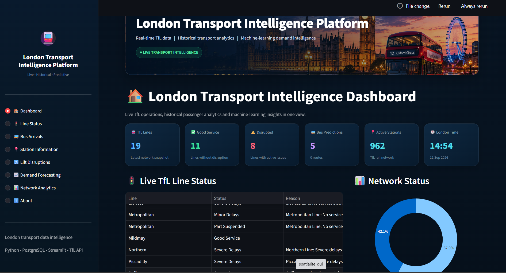

# 🚇 London Transport Intelligence Platform

An end-to-end data analytics and machine learning platform for monitoring, analysing and forecasting public transport demand across London.

The platform combines **live Transport for London (TfL) API data**, historical transport datasets, **PostgreSQL**, machine learning, **Power BI**, and an interactive **Streamlit application** to provide insights into passenger demand, station activity, network conditions and service disruptions.



---

## 📌 Project Overview

London's public transport network generates large volumes of passenger and operational data. This project brings multiple data sources together into a single analytical platform covering:

- London Underground
- London Buses
- Elizabeth line
- London Overground
- DLR

The project demonstrates a complete workflow from **data collection and engineering to SQL analytics, machine learning, visualisation and application development**.

---

## ✨ Key Features

### 🚦 Live Network Monitoring

Live operational information is retrieved through the TfL API, including:

- Line status
- Service disruptions
- Live bus arrivals
- Live rail arrivals
- Lift disruptions
- Station and stop information

A separate Python data collector retrieves operational snapshots and stores them in PostgreSQL for analysis and dashboard use.

### 🚌 Live Bus Intelligence

Users can search for London bus stops and view:

- Upcoming buses
- Route numbers
- Expected arrival times
- Destinations
- Vehicle information
- Stop locations
- Arrival patterns

### 🚉 Station Intelligence

The station interface provides:

- Station location
- Transport mode
- Active lines
- Live arrivals
- Destinations
- Vehicle information
- Arrival-time visualisations

### ♿ Lift Disruption Monitoring

Accessibility information includes:

- Affected stations
- Disrupted lifts
- Current disruption messages
- Station-level disruption summaries
- Accessibility insights

### 📊 Historical Network Analytics

Historical TfL data is used to analyse:

- Tube and bus demand
- Daily passenger journeys
- Long-term demand trends
- Station entry and exit activity
- Weekday and weekend behaviour
- Peak travel patterns
- Station demand profiles

The historical journey dataset contains **2,798 daily observations covering 2019 to August 2026**.

---

## 🤖 Machine Learning Demand Forecasting

Several approaches were evaluated for predicting total daily passenger demand.

| Model | MAE | RMSE | R² |
|---|---:|---:|---:|
| 7-Day Seasonal Baseline | 446,718 | 757,960 | 0.5955 |
| Linear Regression | 395,691 | 598,336 | 0.7480 |
| Random Forest | 227,872 | 362,910 | 0.9073 |
| LightGBM | 222,110 | 348,128 | 0.9147 |
| **XGBoost** | **208,955** | **335,575** | **0.9207** |

**XGBoost achieved the strongest predictive performance with an R² of 0.9207.**

The forecasting model uses calendar, lag and rolling-demand features:

- Day of week
- Day of year
- Week of year
- Month
- Year
- Weekend indicator
- 1-day lag
- 7-day lag
- 14-day lag
- 28-day lag
- 7-day rolling mean
- 28-day rolling mean

The trained XGBoost model is integrated into the Streamlit application, allowing users to generate recursive future demand forecasts for a selected forecast horizon.

---

## 🏗️ Platform Architecture

```text
Historical TfL Data                     Live TfL API
        │                                     │
        └─────────────────┬───────────────────┘
                          │
                      Python ETL
                          │
                          ▼
                     PostgreSQL
                          │
                 ┌────────┴────────┐
                 │                 │
                 ▼                 ▼
       Historical Analytics   Live Analytics
                 │                 │
                 └────────┬────────┘
                          │
                          ▼
                  Machine Learning
                          │
                          ▼
                 Streamlit Platform
```

The overall workflow can be summarised as:

**TfL Data → Python ETL → PostgreSQL → SQL Analytics → Machine Learning → Streamlit / Power BI**

---

## 🛠️ Technology Stack

### Programming & Data Processing
- Python
- Pandas
- NumPy

### Machine Learning
- XGBoost
- LightGBM
- Random Forest
- Linear Regression
- Scikit-learn

### Database
- PostgreSQL
- SQL

### Data Visualisation
- Streamlit
- Plotly
- Power BI

### Data Engineering
- TfL Unified API
- REST APIs
- Python ETL pipelines

### Development & Version Control
- Jupyter Notebook
- Git
- GitHub

---

## 🗄️ Data Sources

The project uses publicly available historical transport datasets and live operational data from **Transport for London (TfL)**.

### Historical Data

- Journey demand data
- Station footfall data
- NUMBAT station demand profiles
- PTAL data
- Annualised station statistics

### Live Data

- TfL line status
- Bus arrivals
- Rail arrivals
- Lift disruptions
- Station and stop information

Large raw datasets and local database files are intentionally excluded from the GitHub repository.

---

## 📂 Repository Structure

```text
london-transport-intelligence-platform/
│
├── app/
│   └── app.py
│
├── data/
│   └── processed/
│
├── image/
│   └── bannerimage.png
│
├── models/
│   └── xgboost_network_demand_model.pkl
│
├── notebooks/
│   └── TfL_Transport_Analysis.ipynb
│
├── powerbi/
│   └── tfl_intiligence.pbix
│
├── screenshots/
│   └── dashboard.png
│
├── collect_live_data.py
├── postgres.sql
├── requirements.txt
├── README.md
└── .gitignore
```

---

## 📊 Power BI Analysis

The repository includes a Power BI report containing interactive analysis of London transport data.

The report focuses on:

- Network-level passenger demand
- Station intelligence
- Temporal travel patterns
- Peak-period analysis
- Tube and bus demand comparisons

Power BI file:

```text
powerbi/tfl_intiligence.pbix
```

---

## 📓 Jupyter Analysis

The Jupyter Notebook contains the analytical and machine learning workflow used during project development.

It includes:

- Data exploration
- Data preprocessing
- Feature engineering
- Time-based analysis
- Model development
- Model comparison
- Demand forecasting evaluation

Notebook:

```text
notebooks/TfL_Transport_Analysis.ipynb
```

---

## ⚙️ Running the Application

### 1. Clone the Repository

```bash
git clone https://github.com/poudelkeshav/london-transport-intelligence-platform.git
cd london-transport-intelligence-platform
```

### 2. Install Dependencies

```bash
pip install -r requirements.txt
```

### 3. Configure PostgreSQL

Create a PostgreSQL database and use the provided SQL file where appropriate:

```text
postgres.sql
```

Database credentials should be stored securely as environment variables and should **never be committed to GitHub**.

For example:

```text
DB_PASSWORD=your_database_password
```

### 4. Run the Streamlit Application

```bash
streamlit run app/app.py
```

---

## 📡 Live Data Collection

Live TfL operational snapshots can be collected using:

```bash
python collect_live_data.py
```

The collector retrieves current operational information from the TfL API and stores the results in PostgreSQL.

The collection script can be run manually or scheduled externally depending on the deployment environment.

---

## 📈 Streamlit Modules

The interactive application contains eight main modules:

1. 🏠 Dashboard
2. 🚦 Line Status
3. 🚌 Bus Arrivals
4. 📍 Station Information
5. ♿ Lift Disruptions
6. 📈 Demand Forecasting
7. 📊 Network Analytics
8. ℹ️ About

These modules combine live operational information, historical analytics and machine-learning insights within one interface.

---

## 🎯 Project Purpose

The purpose of this project was to build more than a standalone machine learning model.

It demonstrates an end-to-end data workflow:

**API Ingestion → Data Engineering → PostgreSQL → SQL Analytics → Machine Learning → Interactive Visualisation**

The project demonstrates practical experience across **data analytics, data science, machine learning and data engineering**, while applying these skills to a real-world London transport use case.

---

## 🔮 Future Development

Potential future extensions include:

- Cloud deployment
- Automated cloud-based data collection
- FastAPI service layer
- Docker containerisation
- Weather and event-data integration
- Additional anomaly detection
- Spatial demand forecasting
- Historical disruption modelling when sufficient labelled data becomes available

---

## 👤 Author

**Keshav Poudel**

Data Science | Data Analytics | Machine Learning | Python | SQL | Power BI

GitHub: [poudelkeshav](https://github.com/poudelkeshav)

Project Repository: [London Transport Intelligence Platform](https://github.com/poudelkeshav/london-transport-intelligence-platform)

---

*Personal data science and transport analytics project focused on building an end-to-end intelligence platform for London's public transport network.*
